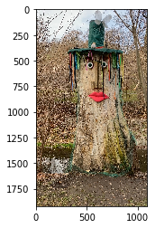
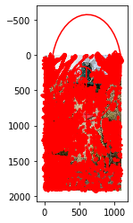
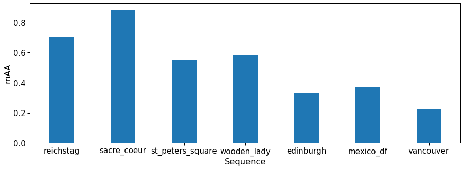
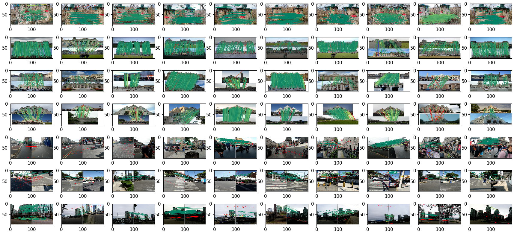
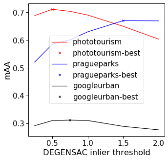

# Submitting to Image Matching Challenge 2021
> "Step by step tutorial"
- toc: false
- image: images/matching-filtering_small.png
- branch: master
- badges: true
- comments: true
- hide: false
- search_exclude: false

## What is Image Matching Challenge?

IMC is a benchmark and [challenge](https://www.cs.ubc.ca/research/image-matching-challenge/current/) for the local features (such as SIFT, SuperPoint, etc), matching methods (CNe, SuperGlue, etc.) and robust geometry estimators such as RANSAC, at [CVPR 2021 Workshop on Image Matching](https://image-matching-workshop.github.io/). 

I will walk you through the submission process, including writing setting-up an environment, writing a processing script and tuning matching and RANSAC for the best performance. As this is a tutorial, not a research paper, we use local feature descriptor available in [kornia](https://github.com/kornia/kornia) for this sample submission.

All the codes and scripts in this tutorial are also avilable at https://github.com/ducha-aiki/imc2021-sample-kornia-submission. Let's go!

## Setting up the environment

First, let's clone the benchmark repository.
```bash
git clone https://github.com/ubc-vision/image-matching-benchmark
cd image-matching-benchmark
git submodule update --init --recursive
```

Now we need to create conda virtual environment. I assume that you have conda installed, and if not - please, follow instructions [here](https://conda.io/projects/conda/en/latest/user-guide/install/index.html) 

```bash
conda env create -f system/conda_env_dm.yml
```

After successfull environment creation, let's activate it

```bash
conda activate sfm
```


## Downloading the data


IMC-2021 data consists of [3 datasets](https://www.cs.ubc.ca/research/image-matching-challenge/2021/data/): Phototourism, PragueParks and GoogleUrban. You can download first two freely, but need to request a credentials and accept license agreement for the GoogleUrban dataset. 

Latter is done by writing an email to image-matching@googlegroups.com and asking for the password.
All datasets consist of two parts each: test part, which contains only images and validation part, which comes together with ground truth. Validation ground truth can (and should!) be used for hyperparameter tuning for your submission. 

```bash
cd ..
mkdir imc-2021-data
cd imc-2021-data
wget https://www.cs.ubc.ca/research/kmyi_data/imc2021-public/imc-2021-test-public-pragueparks.tar.gz
wget https://www.cs.ubc.ca/research/kmyi_data/imc2021-public/imc-2021-validation-pragueparks.tar.gz
wget https://www.cs.ubc.ca/research/kmyi_data/imc2021-public/imc-2021-test-public-phototourism.tar.gz
wget https://www.cs.ubc.ca/research/kmyi_data/imc2021-public/imc-2021-validation-phototourism.tar.gz

```

I am assuming that you have requsted an access to the GoogleUrban dataset, downloaded it and put in the same directory, as the rest of the data:

```
(sfm) mishkdmy@n33:~/dev/imc-2021-data$ ls
imc-2021-test-public-googleurban.tar.gz   imc-2021-validation-googleurban.tar.gz
imc-2021-test-public-phototourism.tar.gz  imc-2021-validation-phototourism.tar.gz
imc-2021-test-public-pragueparks.tar.gz   imc-2021-validation-pragueparks.tar.gz
```

Now let's unpack it.

```bash
for f in *.tar.gz ; do tar -xzf $f; done

```

Now the directory should look like this:

```
(sfm) mishkdmy@n33:~/dev/imc-2021-data$ ls
googleurban                               imc-2021-validation-phototourism.tar.gz
imc-2021-test-public-googleurban.tar.gz   imc-2021-validation-pragueparks.tar.gz
imc-2021-test-public-phototourism.tar.gz  phototourism
imc-2021-test-public-pragueparks.tar.gz   pragueparks
imc-2021-validation-googleurban.tar.gz
```


## Extracting the features

Let's start with creating the directory for our scripts (or you can clone it from [here](https://github.com/ducha-aiki/imc2021-sample-kornia-submission) )

```bash
cd ..
mkdir imc2021-sample-kornia-submission
cd imc2021-sample-kornia-submission
```

Now we will create a script, which extracts [AffNet](https://arxiv.org/abs/1711.06704)-[HardNet8](https://arxiv.org/abs/2007.09699) descriptors on top of OpenCV [SIFT](https://www.cs.ubc.ca/~lowe/papers/ijcv04.pdf) keypoints. 

We need to install [pytorch](https://github.com/pytorch/pytorch) and [kornia](https://github.com/kornia/kornia) for this:

```bash
pip install torch torchvision kornia
pip install kornia_moons --no-deps
```

Great! Now we are ready to extract the features from the images. 
Required imports and initializations:


```python
import matplotlib.pyplot as plt
import numpy as np
import cv2
import torch
import kornia as K
import kornia.feature as KF
from kornia_moons.feature import *

device = torch.device('cpu')
try:
    if torch.cuda.is_available():
        device = torch.device('cuda')
        print ("GPU mode")
except:
    print ('CPU mode')
device = torch.device('cpu')
# SIFT (DoG) Detector
sift_det =  cv2.SIFT_create(8000, contrastThreshold=-10000, edgeThreshold=-10000)

# HardNet8 descriptor

hardnet8 = KF.HardNet8(True).eval().to(device)

# Affine shape estimator
affnet = KF.LAFAffNetShapeEstimator(True).eval().to(device)
```

Now we can define extract_features function. Feel free to modify it for your own features.


```python
device = torch.device('cpu')
```


```python
def extract_features(img_fname, detector, affine, descriptor, device, visualize=False):
    img = cv2.cvtColor(cv2.imread(img_fname), cv2.COLOR_BGR2RGB)
    if visualize:
        plt.imshow(img)
    kpts = detector.detect(img, None)[:8000]
    # We will not train anything, so let's save time and memory by no_grad()
    with torch.no_grad():
        timg = K.image_to_tensor(img, False).float()/255.
        timg = timg.to(device)
        timg_gray = K.rgb_to_grayscale(timg)
        # kornia expects keypoints in the local affine frame format. 
        # Luckily, kornia_moons has a conversion function
        lafs = laf_from_opencv_SIFT_kpts(kpts, device=device)
        lafs_new = affine(lafs, timg_gray)
        if visualize:
            visualize_LAF(timg, lafs_new, 0)
        patches = KF.extract_patches_from_pyramid(timg_gray, lafs_new, 32)
        B, N, CH, H, W = patches.size()
        # Descriptor accepts standard tensor [B, CH, H, W], while patches are [B, N, CH, H, W] shape
        # So we need to reshape a bit :) 
        descs = descriptor(patches.view(B * N, CH, H, W)).view(B * N, -1).detach().cpu().numpy()    
    return kpts, descs
```

Let's check how it works on a single image.


```python
img_fname = '../imc-2021-data/pragueparks/wooden_lady/set_100/images/IMG_9603.MOV_frame000001.jpg'
kpts, descs = extract_features(img_fname,  sift_det, affnet, hardnet8, device, True)
```








```python
descs.std()
```


    0.088384286


So far, so good. Now we need to convert our keypoints from OpenCV format to the benchmark format, which is `numpy.array` `[N x dim]`


```python
def convert_kpts_to_imc(cv2_kpts):
    keypoints = np.array([(x.pt[0], x.pt[1]) for x in cv2_kpts ]).reshape(-1, 2)
    scales = np.array([12.0* x.size for x in cv2_kpts ]).reshape(-1, 1)
    angles = np.array([x.angle for x in cv2_kpts ]).reshape(-1, 1)
    responses = np.array([x.response for x in cv2_kpts]).reshape(-1, 1)
    return keypoints, scales, angles, responses
```

Now we are ready to write a script, which extracts local features for all images in the IMC-2021. The full script is accesible [here](https://github.com/ducha-aiki/imc2021-sample-kornia-submission/blob/master/extract_features_imc.py)


```python
import os
import h5py
from tqdm import tqdm


INPUT_DIR = '../imc-2021-data'
OUT_DIR = 'extracted/cv2-dog-affnet-hardnet8'

os.makedirs(OUT_DIR, exist_ok=True)
datasets = os.listdir(INPUT_DIR)
for ds in datasets:
    ds_in_path = os.path.join(INPUT_DIR, ds)
    ds_out_path = os.path.join(OUT_DIR, ds)
    os.makedirs(ds_out_path, exist_ok=True)
    seqs = os.listdir(ds_in_path)
    for seq in seqs:
        if os.path.isdir(os.path.join(ds_in_path, seq, 'set_100')):
            seq_in_path = os.path.join(ds_in_path, seq, 'set_100', 'images')
        else:
            seq_in_path = os.path.join(ds_in_path, seq)
        seq_out_path = os.path.join(ds_out_path, seq)
        os.makedirs(seq_out_path, exist_ok=True)
        img_fnames = os.listdir(seq_in_path)
        num_kp = []
        with h5py.File(f'{seq_out_path}/keypoints.h5', 'w') as f_kp, \
             h5py.File(f'{seq_out_path}/descriptors.h5', 'w') as f_desc, \
             h5py.File(f'{seq_out_path}/scores.h5', 'w') as f_score, \
             h5py.File(f'{seq_out_path}/angles.h5' 'w') as f_ang, \
             h5py.File(f'{seq_out_path}/scales.h5', 'w') as f_scale:
            for img_fname in tqdm(img_fnames):
                img_fname_full = os.path.join(seq_in_path, img_fname)
                key = os.path.splitext(os.path.basename(img_fname))[0]
                kpts, descs = extract_features(img_fname_full,  sift_det, affnet, hardnet8, device, False)
                keypoints, scales, angles, responses = convert_kpts_to_imc(kpts)
                f_kp[key] = keypoints
                f_desc[key] = descs.reshape(-1, 128)
                f_score[key] = responses
                f_ang[key] = angles
                f_scale[key] = scales
                num_kp.append(len(keypoints))
            print(f'Finished processing "{ds}/{seq}" -> {np.array(num_kp).mean()} features/image')
```

## Creating config json file

In addition to features, we should submit a config file, which tells the benchmark, how the features should be matched and which RANSAC we prefer.
In priciple, we can just write an arbitrary config file and submit already, but this may lead to the bad results. Let's instead generate a config file from python, so we can easily re-generate it. Why would we need this? Quite simple - to try different parameters on the validation set and only then create a final config. 

First part of the config is `metadata` -- information about the method and authors.
If your method is under review, you may want to set flag `publish_anonymously` to `True`.


```python
metadata_dict =  {
    "publish_anonymously": False,
    "authors": "Dmytro Mishkin, Milan Pultar and kornia team",
    "contact_email": "ducha.aiki@gmail.com",
    "method_name": "CV-DoG-AffNet-HardNet8 (kornia)",
    "method_description": 
    r"""OpeCV SIFT keypoints 8000 features, followed by the AffNet normalization 
    and HardNet8 descriptor as implemented in kornia.
    Matched using the built-in matcher (bidirectional filter with the 'both' strategy, 
    hopefully optimal inlier and ratio test thresholds) with DEGENSAC""",
    "link_to_website": "https://github.com/kornia/kornia",
    "link_to_pdf": "https://arxiv.org/abs/2007.09699"
}
```

Second part is `config_common`: it tells the benchmark, which keypoints and descriptors you use. 
We will also need this names when importing our features during tuning on the validation set.


```python
config_common_dict =  {"json_label": "dog-affnet-hardnet8-degensac",
    "keypoint": "cv2dog",
    "descriptor": "affnethardnet8",
    "num_keypoints": 8000}
```

Now comes the information how to match your local features. It may vary from dataset to dataset and also be different for the `multiview` and `stereo` mode. That is why we will create a template dictionary and change some parameters later.

Specifically, we have to specify, which distance our descriptor prefers: `L2`, `L1` and `Hamming` are supported. 

Then comes the tentative matches filtering. One can pass `none` for no filtering, `snn_ratio_pairwise` for Lowe's SNN ratio and `fginn_ratio_pairwise` for FGINN. If you are not familiar with filtering strategies, checkout this blogpost: "[How to match: to learn or not to learn?](https://ducha-aiki.medium.com/how-to-match-to-learn-or-not-to-learn-part-2-1ab52ede2022)".
The threshold is what have to be tunes.

We will use SNN, because of simplicity. Finally, we would like to make sure that tentative matches are cross-consistent, that is why we will enable  `symmetric` matching.

**Warning!** We will use *FLANN* approximate nearest neighbor matching for speed-up tuning procedure, but it is better to turn it off for the final submission.


```python
from copy import deepcopy

matcher_template_dict = {
     "method": "nn",
     "distance": "L2",
     "flann": True,
     "num_nn": 1,
     "filtering": {
         "type": "snn_ratio_pairwise",
         "threshold": 0.90
     },
     "symmetric": {
         "enabled": True,
         "reduce": "both",
     }
}
```

Finally, we have to specify robust geometry estimation method. We will pick the default choise from the previous challenge - [DEGENSAC](https://github.com/ducha-aiki/pydegensac).
`threshold` is what have to be tuned, the rest of parameters are already optimal, or fixed by the competition rules -- `max_iter`.


```python
geom_template_dict =  {"method": "cmp-degensac-f",
                "threshold": 0.5,
                "confidence": 0.999999,
                "max_iter": 100000,
                "error_type": "sampson",
                "degeneracy_check": True,
            }
```

Let's assemble and save our base config.


```python
import json

base_config =  {
    "metadata": metadata_dict,
    "config_common": config_common_dict,
    "config_phototourism_stereo": {
        "use_custom_matches": False,
        "matcher": deepcopy(matcher_template_dict),
        "outlier_filter": { "method": "none" },
        "geom": deepcopy(geom_template_dict)
        },
    "config_phototourism_multiview": {
        "use_custom_matches": False,
        "matcher": deepcopy(matcher_template_dict),
        "outlier_filter": { "method": "none" },
        "colmap": {}},
    
    "config_pragueparks_stereo": {
        "use_custom_matches": False,
        "matcher": deepcopy(matcher_template_dict),
        "outlier_filter": { "method": "none" },
        "geom": deepcopy(geom_template_dict)
        },
    "config_pragueparks_multiview": {
        "use_custom_matches": False,
        "matcher": deepcopy(matcher_template_dict),
        "outlier_filter": { "method": "none" },
        "colmap": {}},
    "config_googleurban_stereo": {
        "use_custom_matches": False,
        "matcher": deepcopy(matcher_template_dict),
        "outlier_filter": { "method": "none" },
        "geom": deepcopy(geom_template_dict)
        },
    "config_googleurban_multiview": {
        "use_custom_matches": False,
        "matcher": deepcopy(matcher_template_dict),
        "outlier_filter": { "method": "none" },
        "colmap": {}}
}

```

Finally, benchmark expects multiple configs, so we have to create a list, and then we can save our config


```python
import json 

with open('base_config.json', 'w') as f:
    json.dump([base_config], f, indent=2)
```

# Preliminary evaluation

Now let's check how our features perform on validation set. We have to import our feature to the benchmark and run the benchmark.

I will cheat a little bit here and skip the multiview evaluation. The reason is that it requires [colmap](https://colmap.github.io), which might be not easy to install. 

### Importing features

Here we have to provide the same `keypoint` and `descriptor` names, as we wrote in json config. 
The rest of arguments are straightforward: path to features, json, etc.


```bash
cd ../image-matching-benchmark/
python -utt import_features.py --kp_name cv2dog --desc_name affnethardnet8 --num_keypoints 8000 --path_features ../imc2021-sample-kornia-submission/extracted/cv2-dog-affnet-hardnet8  --path_results ../benchmark-results --subset both  --is_challenge false --path_json ../imc2021-sample-kornia-submission/base_config.json  --datasets phototourism googleurban pragueparks
```

### Running the evaluation

Now we are ready to run the evaluation

```bash
python -utt run.py --run_mode=interactive --json_method=../imc2021-sample-kornia-submission/base_config.json --subset=val  --eval_multiview=False --path_data ../imc-2021-data/ --path_results ../benchmark-results --is_challenge false
```


After a while (an 30 min for 32 cores machine), the process will finish and you will see the following log message:

```
 -- Saving to: "packed-val/dog-affnet-hardnet8-degensac.json"
```

### Reading results

Json file with evaluation results is saved to `image-matching-benchmark/packed-val/dog-affnet-hardnet8-degensac.json`, and some visualizations -- to `../benchmark-visualization/png`.

First, we come back to our `imc2021-sample-kornia-submission` directory:

```bash
cd ../imc2021-sample-kornia-submission
```

Metric, which are used for the competition is mean average accuracy (mAA) at visibility threshold 0.1


```python
hashname='dog-affnet-hardnet8-degensac'
res_fname = os.path.join('../image-matching-benchmark/packed-val', f'{hashname}.json')

with open(res_fname, 'r') as f:
    results = json.load(f)

submission_name = results['config']['metadata']['method_name']
datasets = ['phototourism', 'pragueparks', 'googleurban']
tasks = ['stereo'] # ['stereo', 'multiview']  #Remember, that we skip colmap evaluations
metric = 'qt_auc_10_th_0.1'
for dset in datasets:
    for task in tasks:
        mAA = results[dset]['results']['allseq'][task]['run_avg'][metric]['mean']
        print (f'{submission_name} {task} mAA for {dset} is {mAA:.4f}')
```

    CV-DoG-AffNet-HardNet8 (kornia) stereo mAA for phototourism is 0.7108
    CV-DoG-AffNet-HardNet8 (kornia) stereo mAA for pragueparks is 0.5850
    CV-DoG-AffNet-HardNet8 (kornia) stereo mAA for googleurban is 0.3099


We can also see results sequence-by-sequence


```python
import seaborn as sns
sns.set_context('paper', font_scale=1.7)
seqs = []
mAAs = []
for dset in datasets:
    for task in tasks:
        for seq in results[dset]['results'].keys():
            if seq == 'allseq': 
                continue
            mAA  = results[dset]['results'][seq][task]['run_avg'][metric]['mean']
            mAAs.append(mAA)
            seqs.append(seq)
fig, ax = plt.subplots(figsize=(15,5))
xticks = 2*np.arange(len(seqs))
ax.set_xticks(xticks)
ax.bar(xticks, mAAs)
ax.set_xticklabels(seqs)
ax.set_ylabel('mAA')
ax.set_xlabel('Sequence')
```


    Text(0.5, 0, 'Sequence')





How do our feature correspondences look like?


```python
import cv2
def plot_image_grid(images, ncols=None, cmap='gray'):
    #Taken from https://stackoverflow.com/a/66961099/1983544
    '''Plot a grid of images'''
    if not ncols:
        factors = [i for i in range(1, len(images)+1) if len(images) % i == 0]
        ncols = factors[len(factors) // 2] if len(factors) else len(images) // 4 + 1
    nrows = int(len(images) / ncols) + int(len(images) % ncols)
    imgs = [images[i] if len(images) > i else None for i in range(nrows * ncols)]
    f, axes = plt.subplots(nrows, ncols, figsize=(3*ncols, 2*nrows))
    axes = axes.flatten()[:len(imgs)]
    for img, ax in zip(imgs, axes.flatten()): 
        if np.any(img):
            if len(img.shape) > 2 and img.shape[2] == 1:
                img = img.squeeze()
            ax.imshow(img, cmap=cmap)
imgs = []
VIS_DIR = f'../benchmark-visualization/png/{hashname}'
for dset in os.listdir(VIS_DIR):
    dset_dir = os.path.join(VIS_DIR, dset)
    for seq in os.listdir(dset_dir):
        seq_dir = os.path.join(dset_dir, seq, 'stereo')
        for img_fname in os.listdir(seq_dir):
            full_fname = os.path.join(seq_dir, img_fname)
            img = cv2.resize(cv2.cvtColor(cv2.imread(full_fname), cv2.COLOR_BGR2RGB), (200,100))
            imgs.append(img)
plot_image_grid(imgs)
```





## Hyperparameters tuning

Let's now tune our hyperparameters, specifically, matching threshold and RANSAC inlier ratio. First we tune RANSAC and then matching ratio.
We need to generate jsons for each configuration. 


```python
inl_ths = [0.25, 0.5, 0.75, 1.0, 1.5, 2.0, 2.5, 3.0]
configs = []

for inl_th in inl_ths:
    current_config = deepcopy(base_config)
    for dset in ['phototourism', 'pragueparks', 'googleurban']:
        current_config[f'config_{dset}_stereo']['geom']['threshold'] = inl_th
    label = current_config['config_common']['json_label'] 
    current_config['config_common']['json_label']  = f'{label}-inlth-{inl_th}'
    configs.append(current_config)

with open('ransac_tuning.json', 'w') as f:
    json.dump(configs, f, indent=2)
```


```bash
cd ../image-matching-benchmark/
python -utt run.py --run_mode=interactive --json_method=../imc2021-sample-kornia-submission/base_config.json --subset=val  --eval_multiview=False --path_data ../imc-2021-data/ --path_results ../benchmark-results --is_challenge false
cd ../imc2021-sample-kornia-submission
```

Now we will write a function, which reads results and picks the best threshold per dataset


```python
hashname='dog-affnet-hardnet8-degensac'
res_dict = {}
datasets = ['phototourism', 'pragueparks', 'googleurban']
for dset in datasets:
    res_dict[dset] = {}

task = 'stereo'
metric = 'qt_auc_10_th_0.1'
for inl_th in inl_ths:
    res_fname = os.path.join('../image-matching-benchmark/packed-val', f'{hashname}-inlth-{inl_th}.json')
    try:
        with open(res_fname, 'r') as f:
            results = json.load(f)
    except:
        continue
    submission_name = results['config']['metadata']['method_name']
    res_dict[inl_th] = {}
    for dset in datasets:
        mAA = results[dset]['results']['allseq'][task]['run_avg'][metric]['mean']
        res_dict[dset][inl_th] = mAA
fig, ax = plt.subplots(figsize=(5,5))
colors = ['r','b','k']
final_ths = {}
for i, dset in enumerate(datasets):
    inl_ths = []
    mAAs = []
    for inl_th, mAA in res_dict[dset].items():
        inl_ths.append(inl_th)
        mAAs.append(mAA)
    best_th_idx = np.argmax(np.array(mAAs))
    best_th = inl_ths[best_th_idx]
    best_mAA = mAAs[best_th_idx]
    print (f'Best {dset} mAA = {best_mAA:.4f} with inl_th = {best_th}')
    ax.plot(inl_ths, mAAs, label=dset, color=colors[i])
    ax.plot(best_th, best_mAA, label = f'{dset}-best', marker='x', linestyle='', color=colors[i])
    final_ths[dset] = best_th
    
ax.legend()
ax.set_ylabel('mAA')
ax.set_xlabel('DEGENSAC inlier threshold')
    
```

    Best phototourism mAA = 0.7108 with inl_th = 0.5
    Best pragueparks mAA = 0.6700 with inl_th = 1.5
    Best googleurban mAA = 0.3116 with inl_th = 0.75


    Text(0.5, 0, 'DEGENSAC inlier threshold')





## Creating final submission
Its time to create our final submission!


```python
configs = []
current_config = deepcopy(base_config)
for dset in ['phototourism', 'pragueparks', 'googleurban']:
    current_config[f'config_{dset}_stereo']['geom']['threshold'] = final_ths[dset]
    # I did a little bit of tuning offline for multiview, so we will put it here
    current_config[f'config_{dset}_multiview']['matcher']['filtering']['threshold'] = 0.95
    #Remember, that we should not forget to turn FLANN ofd
    current_config[f'config_{dset}_multiview']['matcher']['flann'] = False
    current_config[f'config_{dset}_stereo']['matcher']['flann'] = False
current_config['metadata']['method_name'] = 'KORNIA TUTORIAL CV-DoG-AffNet-HardNet8'

label = current_config['config_common']['json_label'] 
current_config['config_common']['json_label']  = f'{label}'
configs.append(current_config)

print (current_config)
with open('final_submission.json', 'w') as f:
    json.dump(configs, f, indent=2)
```

    {'metadata': {'publish_anonymously': False, 'authors': 'Dmytro Mishkin, Milan Pultar and kornia team', 'contact_email': 'ducha.aiki@gmail.com', 'method_name': 'KORNIA TUTORIAL CV-DoG-AffNet-HardNet8', 'method_description': "OpeCV SIFT keypoints 8000 features, followed by the AffNet normalization \n    and HardNet8 descriptor as implemented in kornia.\n    Matched using the built-in matcher (bidirectional filter with the 'both' strategy, \n    hopefully optimal inlier and ratio test thresholds) with DEGENSAC", 'link_to_website': 'https://github.com/kornia/kornia', 'link_to_pdf': 'https://arxiv.org/abs/2007.09699'}, 'config_common': {'json_label': 'dog-affnet-hardnet8-degensac', 'keypoint': 'cv2dog', 'descriptor': 'affnethardnet8', 'num_keypoints': 8000}, 'config_phototourism_stereo': {'use_custom_matches': False, 'matcher': {'method': 'nn', 'distance': 'L2', 'flann': True, 'num_nn': 1, 'filtering': {'type': 'snn_ratio_pairwise', 'threshold': 0.9}, 'symmetric': {'enabled': True, 'reduce': 'both'}}, 'outlier_filter': {'method': 'none'}, 'geom': {'method': 'cmp-degensac-f', 'threshold': 0.5, 'confidence': 0.999999, 'max_iter': 100000, 'error_type': 'sampson', 'degeneracy_check': True}}, 'config_phototourism_multiview': {'use_custom_matches': False, 'matcher': {'method': 'nn', 'distance': 'L2', 'flann': True, 'num_nn': 1, 'filtering': {'type': 'snn_ratio_pairwise', 'threshold': 0.95}, 'symmetric': {'enabled': True, 'reduce': 'both'}}, 'outlier_filter': {'method': 'none'}, 'colmap': {}}, 'config_pragueparks_stereo': {'use_custom_matches': False, 'matcher': {'method': 'nn', 'distance': 'L2', 'flann': True, 'num_nn': 1, 'filtering': {'type': 'snn_ratio_pairwise', 'threshold': 0.9}, 'symmetric': {'enabled': True, 'reduce': 'both'}}, 'outlier_filter': {'method': 'none'}, 'geom': {'method': 'cmp-degensac-f', 'threshold': 1.5, 'confidence': 0.999999, 'max_iter': 100000, 'error_type': 'sampson', 'degeneracy_check': True}}, 'config_pragueparks_multiview': {'use_custom_matches': False, 'matcher': {'method': 'nn', 'distance': 'L2', 'flann': True, 'num_nn': 1, 'filtering': {'type': 'snn_ratio_pairwise', 'threshold': 0.95}, 'symmetric': {'enabled': True, 'reduce': 'both'}}, 'outlier_filter': {'method': 'none'}, 'colmap': {}}, 'config_googleurban_stereo': {'use_custom_matches': False, 'matcher': {'method': 'nn', 'distance': 'L2', 'flann': True, 'num_nn': 1, 'filtering': {'type': 'snn_ratio_pairwise', 'threshold': 0.9}, 'symmetric': {'enabled': True, 'reduce': 'both'}}, 'outlier_filter': {'method': 'none'}, 'geom': {'method': 'cmp-degensac-f', 'threshold': 0.75, 'confidence': 0.999999, 'max_iter': 100000, 'error_type': 'sampson', 'degeneracy_check': True}}, 'config_googleurban_multiview': {'use_custom_matches': False, 'matcher': {'method': 'nn', 'distance': 'L2', 'flann': True, 'num_nn': 1, 'filtering': {'type': 'snn_ratio_pairwise', 'threshold': 0.95}, 'symmetric': {'enabled': True, 'reduce': 'both'}}, 'outlier_filter': {'method': 'none'}, 'colmap': {}}}


```
Submission Zip file should have folder structure as follow:
 ├── config.json
 ├── [Dataset 1]
 │   ├── [Sequence 1]
 │   │   ├── keypoints.h5
 │   │   ├── descriptors.h5
 │   │   ├── matches.h5
 │   ├── [Sequence 2]
 │   │   ├── ...
 ├── [Dataset 2]
 │   ├── ...
```

So we have to just copy our features, add config and zip them.

```bash
cp final_submission.json extracted/cv2-dog-affnet-hardnet8/config.json
cd extracted/cv2-dog-affnet-hardnet8
zip -r submission.zip *
```

Last step before the submission - check the submission for correctness with provided script

```bash
cd ../../../image-matching-benchmark
python -utt submission_validator.py --submit_file_path ../imc2021-sample-kornia-submission/extracted/cv2-dog-affnet-hardnet8/submission.zip --benchmark_repo_path . --raw_data_path ../imc-2021-data/ --datasets googleurban phototourism pragueparks
```

If everything is correct, you will see:

```
Validating method 1/1: "dog-affnet-hardnet8-degensac"
['googleurban', 'phototourism', 'pragueparks']
Running: googleurban, stereo track
Running: googleurban, multiview track
Running: phototourism, stereo track
Running: phototourism, multiview track
Running: pragueparks, stereo track
Running: pragueparks, multiview track
Validating key "config_googleurban_stereo"
Validating key "config_googleurban_multiview"
Validating key "config_phototourism_stereo"
Validating key "config_phototourism_multiview"
Validating key "config_pragueparks_stereo"
Validating key "config_pragueparks_multiview"
```

And file `submission_log.txt` will appear near our .zip file.

```bash
cat ../imc2021-sample-kornia-submission/extracted/cv2-dog-affnet-hardnet8/submission_log.txt
```

```
Submission is in proper format, please submit to IMW 2021 website.
```
That's all, folks! We can submit! But, please, do not just submit this sample submission - make your own :)
